# Gambler’s Datamart

This is an overall summary The objective of this analysis is to display
customer insights with a marketing scope. This analysis was made with 3
different datasets: Customer’s Demographics, Daily Aggregations, and
Poker Chips Conversions. They were all merged with a granularity of 1
unique User ID per row.

In total, there are 91 columns with 42647 unique users in the datamart,
as shown in the next overview.

## Data overview

``` r
head(datamart)
```

    ##     UserID    RegDate   FirstPay   FirstAct    FirstSp    FirstCa FirstGa
    ## 1: 1324354 2005-02-01 2005-02-24 2005-02-24 2005-02-24       <NA>    <NA>
    ## 2: 1324355 2005-02-01 2005-02-01 2005-02-01 2005-02-01       <NA>    <NA>
    ## 3: 1324356 2005-02-01 2005-02-01 2005-02-02 2005-02-02       <NA>    <NA>
    ## 4: 1324358 2005-02-01 2005-02-01 2005-02-01 2005-02-01       <NA>    <NA>
    ## 5: 1324360 2005-02-01 2005-02-02 2005-02-02 2005-02-02 2005-02-03    <NA>
    ## 6: 1324362 2005-02-01 2005-02-11 2005-02-11 2005-02-11       <NA>    <NA>
    ##       FirstPo Gender Country   Application Language DaysBeforePay
    ## 1:       <NA>      M Germany  BETANDWIN.DE   German            23
    ## 2: 2005-06-11      M  Greece BETANDWIN.COM    Greek             0
    ## 3:       <NA>      M Germany  BETANDWIN.DE   German             0
    ## 4:       <NA>      M  Sweden BETANDWIN.COM  English             0
    ## 5:       <NA>      M  Turkey BETEUROPE.COM  Turkish             1
    ## 6:       <NA>      M Germany  BETANDWIN.DE   German            10
    ##    TotalStakes_Product1 TotalWinnings_Product1 TotalBets_Product1
    ## 1:           10137.3300             10224.1200                236
    ## 2:             400.8600               453.3000                231
    ## 3:             686.1900               285.5100                 98
    ## 4:             247.6971               153.8756                  7
    ## 5:              59.9993                39.9564                 40
    ## 6:              22.0000                 0.0000                  7
    ##    LifetimeValue_Product1 AverageDailyStake_Product1
    ## 1:               -86.7900                  86.643846
    ## 2:               -52.4400                   4.049091
    ## 3:               400.6800                  13.454706
    ## 4:                93.8215                  30.962138
    ## 5:                20.0429                   2.068941
    ## 6:                22.0000                   3.142857
    ##    AverageDailyWinning_Product1 AverageDailyBets_Product1 TotalStakes_Product2
    ## 1:                    87.385641                  2.017094            1839.2800
    ## 2:                     4.578788                  2.333333              24.7000
    ## 3:                     5.598235                  1.921569             679.0700
    ## 4:                    19.234450                  0.875000              88.5927
    ## 5:                     1.377807                  1.379310               1.7434
    ## 6:                     0.000000                  1.000000                   NA
    ##    TotalWinnings_Product2 TotalBets_Product2 LifetimeValue_Product2
    ## 1:              1512.4900                 43               326.7900
    ## 2:                11.2000                 21                13.5000
    ## 3:               625.1500                116                53.9200
    ## 4:                55.9819                  4                32.6108
    ## 5:                 1.2009                  3                 0.5425
    ## 6:                     NA                 NA                     NA
    ##    AverageDailyStake_Product2 AverageDailyWinning_Product2
    ## 1:                  96.804211                     79.60474
    ## 2:                   3.528571                      1.60000
    ## 3:                  28.294583                     26.04792
    ## 4:                  88.592700                     55.98190
    ## 5:                   0.871700                      0.60045
    ## 6:                         NA                           NA
    ##    AverageDailyBets_Product2 TotalStakes_Product4 TotalWinnings_Product4
    ## 1:                  2.263158                   NA                     NA
    ## 2:                  3.000000                   NA                     NA
    ## 3:                  4.833333                   NA                     NA
    ## 4:                  4.000000                   NA                     NA
    ## 5:                  1.500000                   NA                     NA
    ## 6:                        NA                   NA                     NA
    ##    TotalBets_Product4 LifetimeValue_Product4 AverageDailyStake_Product4
    ## 1:                 NA                     NA                         NA
    ## 2:                 NA                     NA                         NA
    ## 3:                 NA                     NA                         NA
    ## 4:                 NA                     NA                         NA
    ## 5:                 NA                     NA                         NA
    ## 6:                 NA                     NA                         NA
    ##    AverageDailyWinning_Product4 AverageDailyBets_Product4 TotalStakes_Product5
    ## 1:                           NA                        NA                   NA
    ## 2:                           NA                        NA                   NA
    ## 3:                           NA                        NA                   NA
    ## 4:                           NA                        NA                   NA
    ## 5:                           NA                        NA                   NA
    ## 6:                           NA                        NA                   NA
    ##    TotalWinnings_Product5 TotalBets_Product5 LifetimeValue_Product5
    ## 1:                     NA                 NA                     NA
    ## 2:                     NA                 NA                     NA
    ## 3:                     NA                 NA                     NA
    ## 4:                     NA                 NA                     NA
    ## 5:                     NA                 NA                     NA
    ## 6:                     NA                 NA                     NA
    ##    AverageDailyStake_Product5 AverageDailyWinning_Product5
    ## 1:                         NA                           NA
    ## 2:                         NA                           NA
    ## 3:                         NA                           NA
    ## 4:                         NA                           NA
    ## 5:                         NA                           NA
    ## 6:                         NA                           NA
    ##    AverageDailyBets_Product5 TotalStakes_Product6 TotalWinnings_Product6
    ## 1:                        NA                   NA                     NA
    ## 2:                        NA                   NA                     NA
    ## 3:                        NA                   NA                     NA
    ## 4:                        NA                   NA                     NA
    ## 5:                        NA                   NA                     NA
    ## 6:                        NA                   NA                     NA
    ##    TotalBets_Product6 LifetimeValue_Product6 AverageDailyStake_Product6
    ## 1:                 NA                     NA                         NA
    ## 2:                 NA                     NA                         NA
    ## 3:                 NA                     NA                         NA
    ## 4:                 NA                     NA                         NA
    ## 5:                 NA                     NA                         NA
    ## 6:                 NA                     NA                         NA
    ##    AverageDailyWinning_Product6 AverageDailyBets_Product6 TotalStakes_Product7
    ## 1:                           NA                        NA                   NA
    ## 2:                           NA                        NA                   NA
    ## 3:                           NA                        NA                   NA
    ## 4:                           NA                        NA                   NA
    ## 5:                           NA                        NA                   NA
    ## 6:                           NA                        NA                   NA
    ##    TotalWinnings_Product7 TotalBets_Product7 LifetimeValue_Product7
    ## 1:                     NA                 NA                     NA
    ## 2:                     NA                 NA                     NA
    ## 3:                     NA                 NA                     NA
    ## 4:                     NA                 NA                     NA
    ## 5:                     NA                 NA                     NA
    ## 6:                     NA                 NA                     NA
    ##    AverageDailyStake_Product7 AverageDailyWinning_Product7
    ## 1:                         NA                           NA
    ## 2:                         NA                           NA
    ## 3:                         NA                           NA
    ## 4:                         NA                           NA
    ## 5:                         NA                           NA
    ## 6:                         NA                           NA
    ##    AverageDailyBets_Product7 TotalStakes_Product8 TotalWinnings_Product8
    ## 1:                        NA                   NA                     NA
    ## 2:                        NA                   NA                     NA
    ## 3:                        NA                   NA                     NA
    ## 4:                        NA                   NA                     NA
    ## 5:                        NA                    4                      2
    ## 6:                        NA                   NA                     NA
    ##    TotalBets_Product8 LifetimeValue_Product8 AverageDailyStake_Product8
    ## 1:                 NA                     NA                         NA
    ## 2:                 NA                     NA                         NA
    ## 3:                 NA                     NA                         NA
    ## 4:                 NA                     NA                         NA
    ## 5:                  4                      2                          4
    ## 6:                 NA                     NA                         NA
    ##    AverageDailyWinning_Product8 AverageDailyBets_Product8 dayofplay monthofplay
    ## 1:                           NA                        NA    Sunday         Apr
    ## 2:                           NA                        NA Wednesday         Feb
    ## 3:                           NA                        NA  Saturday         Feb
    ## 4:                           NA                        NA   Tuesday         May
    ## 5:                            2                         4  Saturday         Feb
    ## 6:                           NA                        NA  Saturday         Sep
    ##    last_othergames_date first_othergames_date total_stakes_othergames
    ## 1:           2005-09-30            2005-02-24              11976.6100
    ## 2:           2005-09-29            2005-02-01                425.5600
    ## 3:           2005-09-12            2005-02-02               1365.2600
    ## 4:           2005-05-06            2005-02-01                336.2898
    ## 5:           2005-09-25            2005-02-02                 65.7427
    ## 6:           2005-09-17            2005-02-11                 22.0000
    ##    total_winnings_othergames total_bets_othergames totalpoker_buy
    ## 1:                11736.6100                   279         0.0000
    ## 2:                  464.5000                   252        30.8295
    ## 3:                  910.6600                   214         0.0000
    ## 4:                  209.8575                    11         0.0000
    ## 5:                   43.1573                    47         0.0000
    ## 6:                    0.0000                     7         0.0000
    ##    totalpoker_sell poker_ltv poker_frequency first_pokertrans_date
    ## 1:          0.0000        NA               0                  <NA>
    ## 2:          8.2593   22.5702               8            2005-06-12
    ## 3:          0.0000        NA               0                  <NA>
    ## 4:          0.0000        NA               0                  <NA>
    ## 5:          0.0000        NA               0                  <NA>
    ## 6:          0.0000        NA               0                  <NA>
    ##    last_poker_date poker_recency poker_Pref_timeofplay poker_Pref_DayofPlay
    ## 1:            <NA>            NA                  <NA>                 <NA>
    ## 2:      2005-06-15           107            Late Night               Sunday
    ## 3:            <NA>            NA                  <NA>                 <NA>
    ## 4:            <NA>            NA                  <NA>                 <NA>
    ## 5:            <NA>            NA                  <NA>                 <NA>
    ## 6:            <NA>            NA                  <NA>                 <NA>
    ##    poker_Pref_MonthofPlay totalmaxdate totalrecency totalfrequency totalrevenue
    ## 1:                   <NA>   2005-09-30            0            279   11976.6100
    ## 2:                    Jun   2005-09-29            1            260     456.3895
    ## 3:                   <NA>   2005-09-12           18            214    1365.2600
    ## 4:                   <NA>   2005-05-06          147             11     336.2898
    ## 5:                   <NA>   2005-09-25            5             47      65.7427
    ## 6:                   <NA>   2005-09-17           13              7      22.0000
    ##     totalcost lifetimevalue profitmargin r_level f_level m_level rfm_level
    ## 1: 11736.6100      240.0000   0.02003906       4       4       4        12
    ## 2:   472.7593      -16.3698  -0.03586805       4       4       1         9
    ## 3:   910.6600      454.6000   0.33297687       3       4       4        11
    ## 4:   209.8575      126.4323   0.37596234       2       1       3         6
    ## 5:    43.1573       22.5854   0.34354232       3       2       2         7
    ## 6:     0.0000       22.0000   1.00000000       3       1       2         6
    ##    customer_level
    ## 1:       Platinum
    ## 2:           Gold
    ## 3:       Platinum
    ## 4:         Bronze
    ## 5:         Silver
    ## 6:         Bronze

    ## [1] "Unique User IDs:  42647"

## General User Overview

First, the following graphs will show a general demographic view for the
company’s users. The majority of the users are Male while the preferred
language is German:

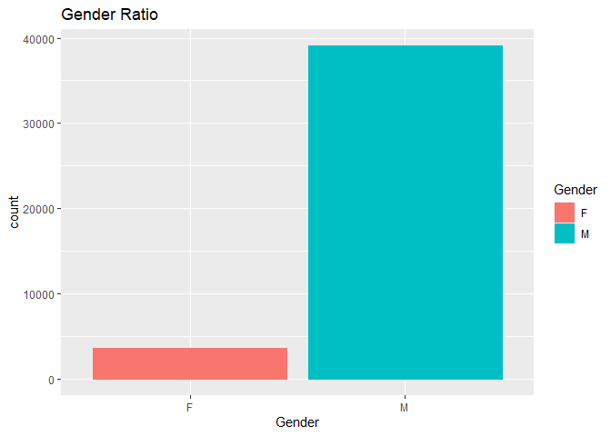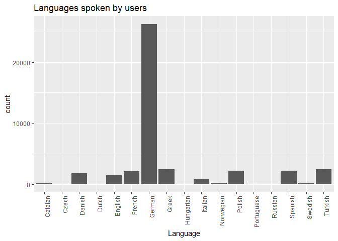

## Users by Location

The majority of the users are located in Europe, where Germany has the
highest population:

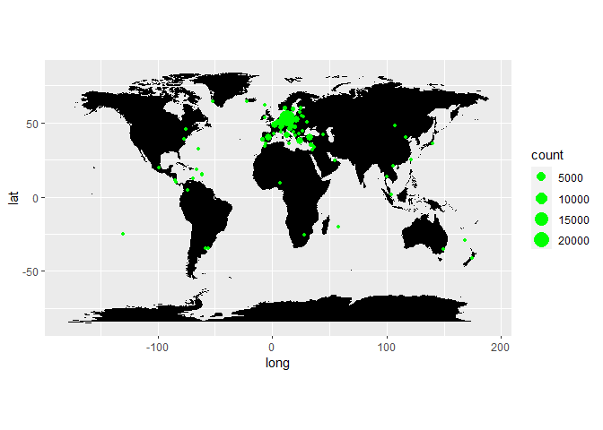

The following countries have more than 1000 Users:

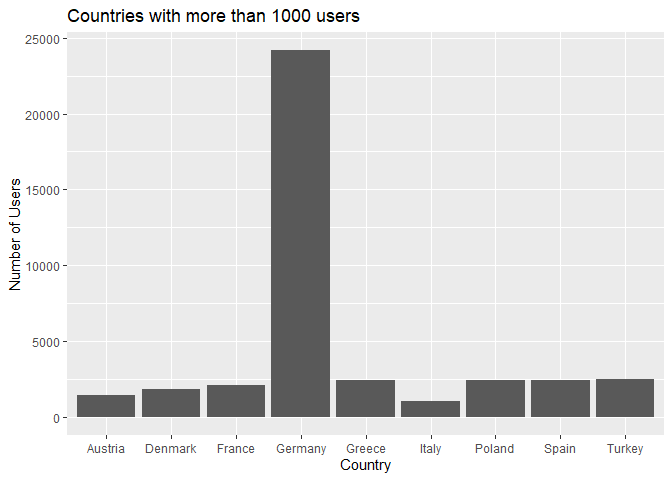

## Application Usage

The top Applications used for gambling are:

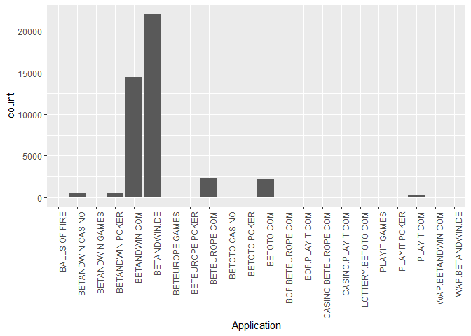

## Total Aggregations

By taking a look at the total aggregations of the full database we can
observe the total cost versus the total revenue:

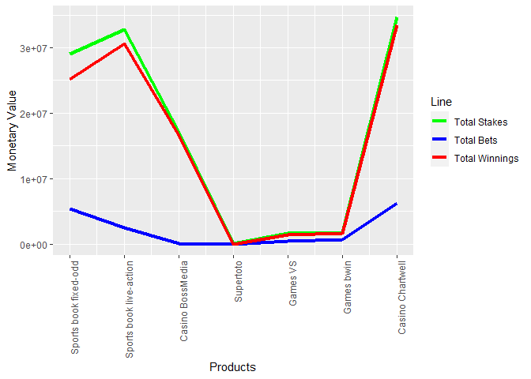

As for Poker we can observe the total buy versus the total sell:

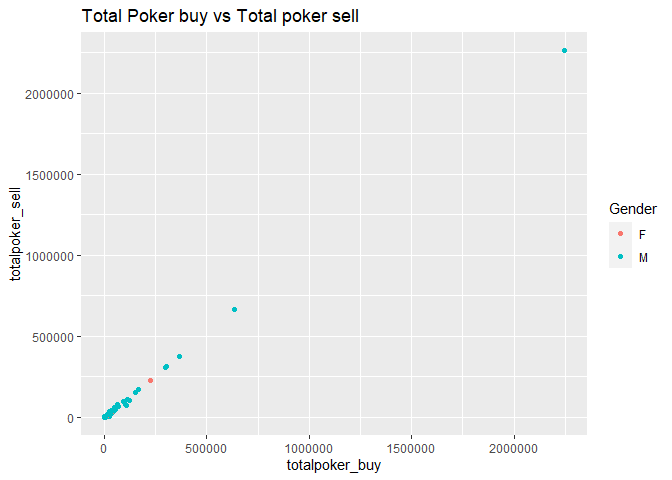

## Customer Segmentation

### RFM Model

For marketing purposes, customers were segmented into 4 different
levels: Platinum, Gold, Silver, and Bronze. This way, we can observe
Platinum as our “ideal” customer and Bronze as our “non-ideal”.

In order to segment our Users, we analyzed their game transaction
behavior with an RFM model. For purposes of the analysis, the period
comprehends February 2005 to September 2005.

-   Recency: number of days since last day played(or last transaction
    for poker)
-   Frequency: count of days with game activity during the given period
    (or number of transactions made, for poker)
-   Monetary Value: Lifetime Value of the player (how much profit is the
    User making for the Casino?)

To do so, first we took our ‘today’ date of the period as September 30
of 2005. The date difference within the account’s last day of play and
the (today) date would show us the recency. Then, simply by counting the
number of days played per User during the period, we calculated the
frequency. Finally, we subtracted the total amount of stakes minus the
user’s winnings (or total buy minus total sell in the case of poker) per
account to calculate monetary value of each User.

Following, we had to assign levels for each RFM value, given that they
are not comparable between each other. To do so, we used a percentile
approach. By dividing the range of values into 4 groups (percentiles),
we assigned 4 different levels to each RFM value, where 1 is the worst
and 4 is the best. For example, in the table below we can observe that
those values with a recency of 0 have an r_level of 4, meaning that it’s
been 0 days since their last transaction (which gives them the highest
score of 4).

    ##     UserID totalrecency totalfrequency lifetimevalue r_level f_level m_level
    ## 1: 1324354            0            279        240.00       4       4       4
    ## 2: 1324355            1            260        -16.37       4       4       1
    ## 3: 1324356           18            214        454.60       3       4       4
    ## 4: 1324358          147             11        126.43       2       1       3
    ## 5: 1324360            5             47         22.59       3       2       2
    ## 6: 1324362           13              7         22.00       3       1       2
    ##    rfm_level customer_level
    ## 1:        12       Platinum
    ## 2:         9           Gold
    ## 3:        11       Platinum
    ## 4:         6         Bronze
    ## 5:         7         Silver
    ## 6:         6         Bronze

Then, by summing the RFM values we can obtain a total RFM Score and we
can segment each account on a particular level. In this case we applied
the following criteria:

-   Bronze Account: RFM score lower than 7
-   Silver Account: RFM score of 7 or higher
-   Gold Account: RFM score of 9 or higher
-   Platinum Account: RFM score of 11 or higher

With the applied criteria, we could easily segment our accounts into
groups of client types as shown below:

    ## 
    ##   Bronze     Gold Platinum   Silver 
    ##    16016     9192     6222    11185

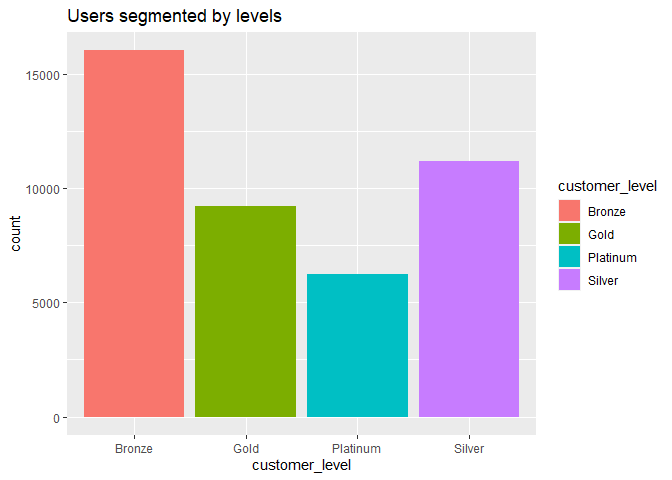

## Visualization by Customer Level

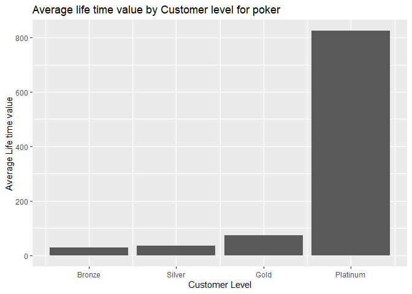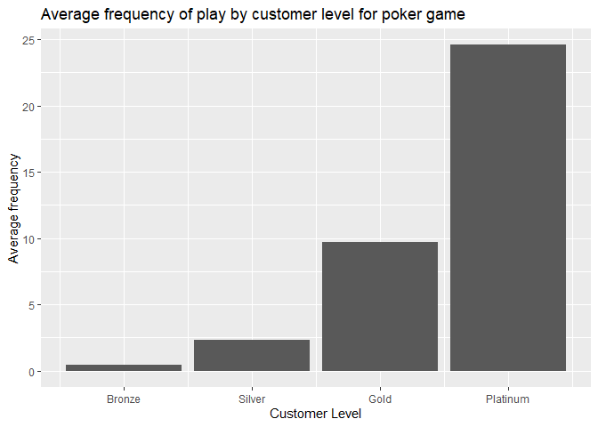

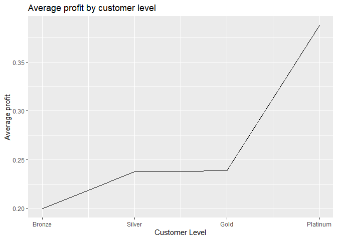
